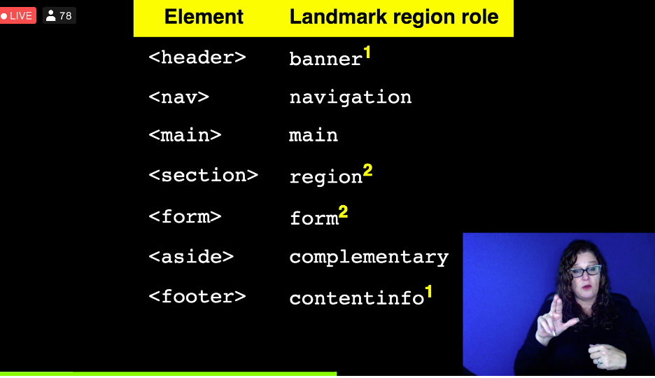
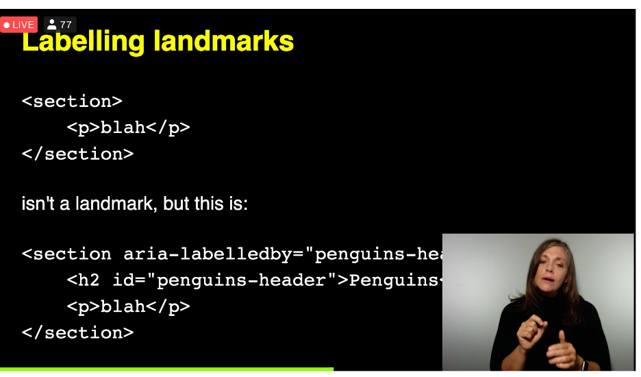

# Landmarks
Speaker: Matthew Tylee Atkinson
Twitter: [@matatk](https://twitter.com/matatk)
[Slides](http://matatk.agrip.org.uk/talks/2020/landmarks/)

- When navigating the web there are two questions
    - What's on the page?
    - how can I get there?
- Headings, lists where used to demark layouts
- Keyboard navigation: 
    - up arrow
    - down arrow
    - TAB
    - SHIFT TABS
- Screen Readers add new shortcuts
    - H: to navigate to next headings
- SR can list all the headings in a page, you can use them to navigate directly to a heading
- Sites have evolved in visual design that communicate sections of a page
- Online Shopping can be improved, for instance how to get to shopping cart
- Skip Links, links provided by the web author, with the purpose to get to main content
- If you're familiar with the site it can help to go straight to content
- Screen reader reads everything on the page. SKip links are important.
- Skip Links
    - Easily discoverable
    - Avoid repeated content
    - Save time
- But, they have limitations
    - only at the top
    - unable to give a full overview of the content
    - not quite useful in app-like settings
- Solutions to this: Land Mark regions
    - Signposts to brad areas of the page
    - Non-visual complement to visual design
    - Random access
    - Part of the W3C ARIA standards
- Landmark examples
    - Navigation
    - Main
    - Contact info (footer)
- Landmark regions in The Paciello Group
    - Banner
        - Navigation
    - Main
    - Content information

## Main Body
- As a page author how can you provide landmarks? Add roles. Examples:
    - `<div role="search"><input type="text"....><button>search</button></div>`
    - `<div role="main"></div>`
    - HTML5 introduces main element with its own landmark `<main></main>`
- How do landmarks help:
    - You can skip to a landmark region
    - SR announces the Landmark automatically
    - Note: SRs announce them differently

## Footer
- `<div class="footer">`
- `<div class="contentinfo">`
- `<footer>`

## Landmark Regions Role


## Labelling Landmarks
- Allows you to differentiate them
- `<section><p>blan</p></section>`
- Screen readers can recognize landmarks if properly labelled

```html
<section aria-labelledy="penguin-header">
    <h2 id="penguins-header">Penguins</h2>
    <p>blah</p>
</section>
```

## 5 Golden rules of Landmarks
1. Landmarks should be used to provide overview, headings should be used to fine grain the navigation
2. Use few landmarks, but cover all the content on the page
3. If more than 1 landmark, use heading to differentiate them
4. No need to include the type of the landmark in its heading
5. Avoid `aria-roledescription` attribute

## Keyboard only users
- Currently they can't navigate using landmarks, without assistive technologies
- Use Matthew's Landmark Navigation Browser Extension [http://github.com/matatk/landmarks](http://github.com/matatk/landmarks)


## Resources
- Regions are only for if there is no other appropriate landmark
