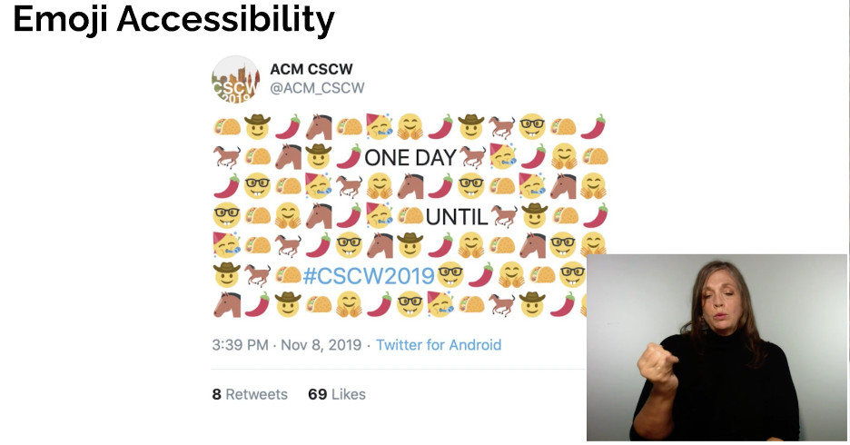
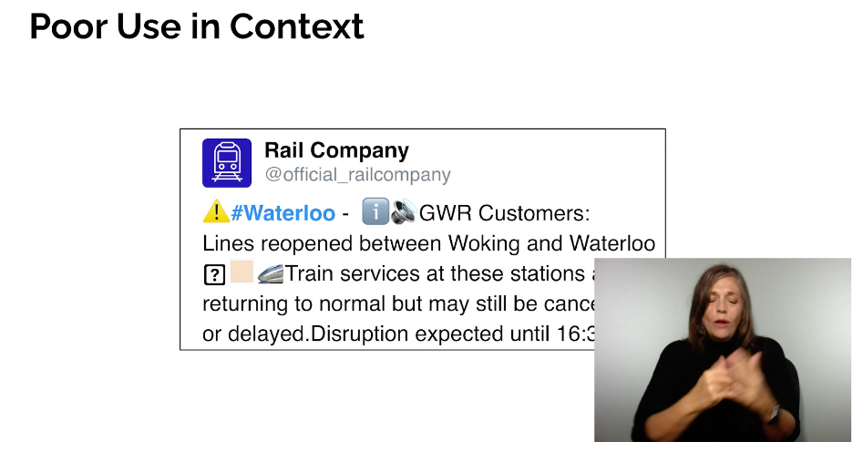
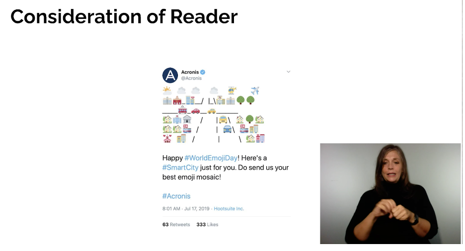

# Uncover The Hidden Challenges Of Using Emoji
Speaker: Rachel Menzes
Twitter: [@Rachel_Menzies](https://twitter.com/Rachel_Menzies)

- Many people has fun sending emojis, but they can cause confusion. Example: heart + smile face
- Emojis have Unicode Charaters
    - face-smiling
    - Face with tires of joy
- Rendering of Unicode Characters are different depending on the device (Android, IOs, web)
- Brown Bear + Snowflake: works in Android but in other cases it doesn't
- Alternative use for emoji: peach, octupus, egg plant
- Screen readers wont be able to interpret if multiple emojis using together 

- There's no autocorrect for Emojis
- Sometimes if you tap on the wrong emoji, Things might get weird
- Using emojis on profile names can derive in weird interpretations for screen reader. Ex: happy face, smile face, Rachel
- Poor use in Context. Ex warning #waterloo information sound alert CWR Customer ...

- https://twitter.com/networkrail?lang=en
- Consider when using emojis.
- Consider the number of emojis you're going to use
- Six emojis with tears is more impactful for visual users, but for screen readers it's too repetitive
- Placement of Emoji. In user name might just be decorative

- Distracting if use at the beginning of a phrase

- Consideration of Reader, following image is complete inaccessible. It describes a road using emoji. This can't be interpreted by Screen Readers

- Emoji can be missing if using an old device, or including new emojis not supported in every device.

## Resources
- Full paper from CHI 2020 is at http://eprints.bournemouth.ac.uk/33854/1/tigwell-gorman-menzies-CHI2020.pdf
-  http://unicode.org/emoji/charts/full-emoji-list.html
